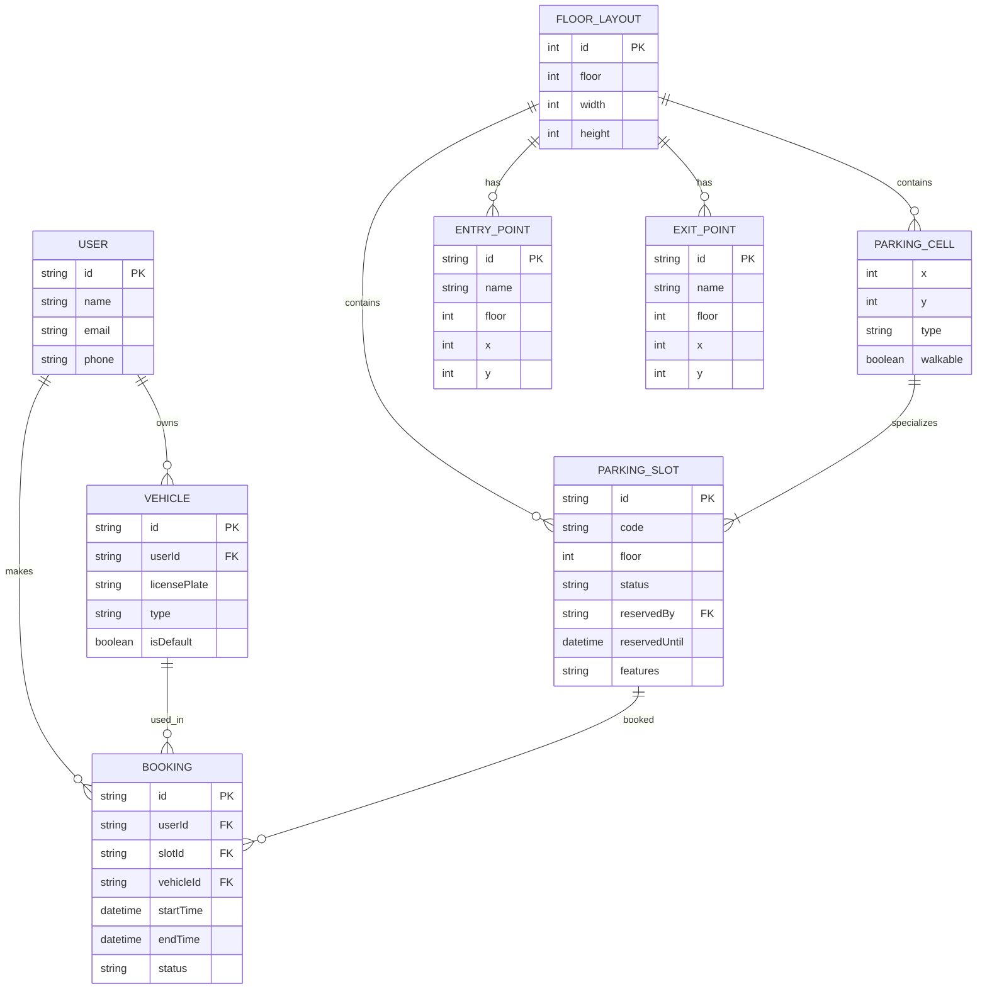

## ERD cho feature parking-map

Dưới đây là sơ đồ ER (Mermaid) mô tả các thực thể chính liên quan đến chức năng bản đồ bãi đỗ (parking-map), gồm quan hệ giữa `User`, `Vehicle`, `Booking`, `FloorLayout`, `ParkingSlot`, `ParkingCell`, `EntryPoint` và `ExitPoint`.

Ghi chú ngắn:
- `Booking` liên kết `User`, `Vehicle` và `ParkingSlot` (thực tế trong code là `slotId`, `userId`, `vehicleId`).
- `FloorLayout` chứa `ParkingCell` (mỗi ô trên lưới) và `ParkingSlot` (các ô có `CellType.SLOT`).
- `EntryPoint` / `ExitPoint` là các loại `ParkingCell` đặc biệt và liên kết với `FloorLayout` bằng thuộc tính `floor`.
- Cập nhật trạng thái chỗ đỗ được nhận qua MQTT (`SlotUpdateMessage`) và có thể cập nhật thực thể `ParkingSlot.status` hoặc tạo log sự kiện riêng.

File này lưu ở: src/features/parking-map/ERD.md
